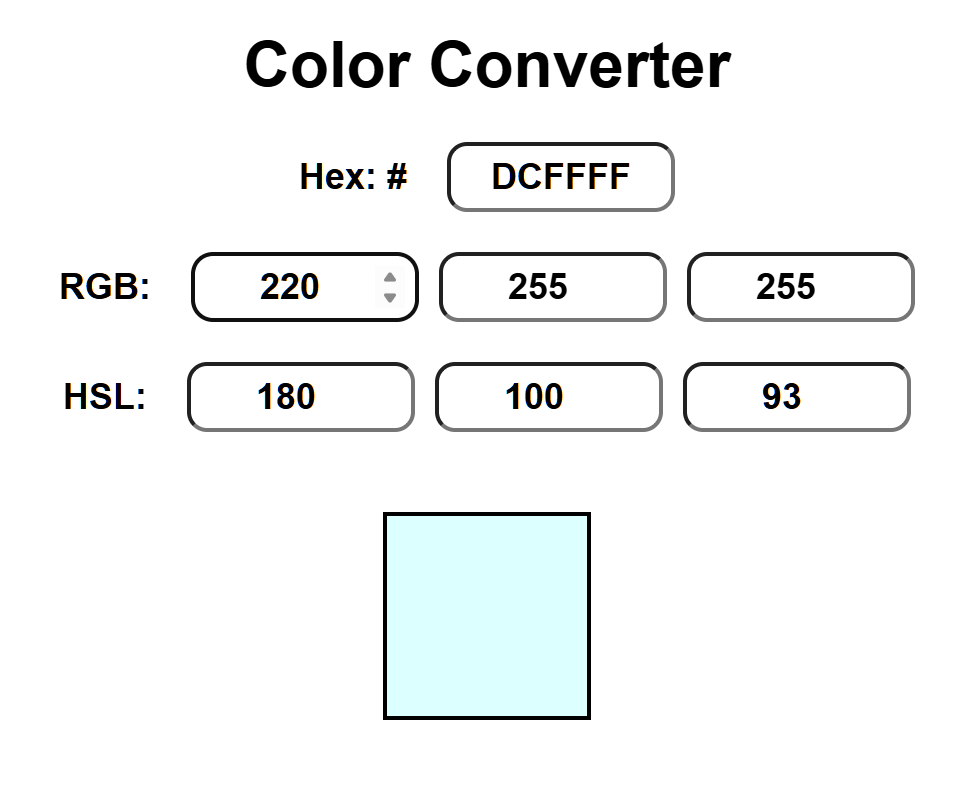

# Color-Convertor

Simple React application that allows you to convert between different color formats.

Purpose: 

-> For Web developers constantly using different color formats when styling websites.

-> Easily visualize color relationships across formats.

Features:

-> Convert between HEX, RGB, and HSL color formats.

-> Enter a value in one format, and the other two will automatically update. (No Submit/Convert button)

-> Preview the selected color at the bottom of the page.

Used Technologies: React Hooks(useState, useEffect, useRef), React Components, JavaScript Functions.

